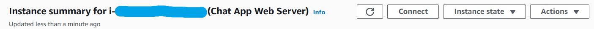

# Chat App  Main Doc
This app is a simple chat app that allows users to chat with each other in real time. It is built using Node.js, Express, and Socket.io. This app is deployed in AWS EC2 with docker and self-hosted service in gitHub this doc will give the all steps and command to do the same.provided the repo of front end and back end of the app. In the document you will see the necessary changes to be done in the code to make it work in your local machine or in the server.

### You can follow the steps to deploy the chat app. And take reference from the code in the [backend repo](https://github.com/animeshmaiti/ChatAppBackend) and [frontend repo](https://github.com/animeshmaiti/ChatAppFrontend).

## Setup aws EC2 instance and docker in it
1. Create an AWS free tire account and login to the console.
2. Go to the EC2 dashboard and click on the launch instance.
3. chose the ubuntu server free tire eligible with 64bit by default.
    
4. Configure the instance t2.micro free tire eligible.
5. create a key pair and download it for ssh access from local machine.
6. leave storage and network settings make ssh allowed from anywhere as default.
    
7. Review and launch the instance.
8. After successful launch click on the instance and note the public IPV4 address.
   
9. setup the security group for the instance to allow the port by editing inbound rules in my case `3000` for frontend and `5000` for backend the chat app.
    
    
10. open the terminal of instance by go to instance and click on connect and follow the steps that written there. you can follow any of the methods to connect to the instance.(ssh or browser based)
    
### Install Docker
1. once you in the terminal of the instance run the following command to update the package index.
```bash
sudo apt-get update
```
2. Install docker by running the following command.
```bash
sudo apt-get install docker.io -y
sudo systemctl start docker
sudo docker run hello-world
docker ps
sudo chmod 666 /var/run/docker.sock
sudo systemctl enable docker
docker --version
```
3. Docker is installed and running now.
### setup the github self-hosted runner
1. Go to the github repo of the chat app backend and click on the settings.
2. Click on the actions and then click on the runners.
3. create new self-hosted runner.
4. we are using linux runner so select linux and follow the instructions written there(download and configure).<br>
   note: `mkdir actions-runner && cd actions-runner` you can change the directory name as you want. all the prompt after running command you can press enter to go with default.
5. you can run the runner by running the following command.
```bash
./run.sh
```
1. after the runner is configured you will see the runner is online in the github repo. But it will be offline after some time because we are not running the runner as a service. we will run it as a service so that it will run in the background. 
2. to run the runner as a service run the following command.[instruction](https://docs.github.com/en/actions/hosting-your-own-runners/managing-self-hosted-runners/configuring-the-self-hosted-runner-application-as-a-service)
```bash
sudo ./svc.sh install
sudo ./svc.sh start
```
3. now the runner is running as a service and it will be online always.
4. now we have the EC2 instance with docker and self-hosted runner setup.
5. now we will deploy the chat app backend and frontend in the EC2 instance.
6.  you need to follow the same steps to setup `github self-hosted runner` for frontend and backend.

## Deploy the chat app backend in EC2 instance
### setup the gitHub secrets and variables
1. Go to the github repo of the chat app backend and click on the settings.
2. Click on the *secrets & variables->actions->New Repo Secret* add the secrets.
    - `DOCKER_USERNAME` : your dockerhub username.
    - `DOCKER_PASSWORD` : your dockerhub password.
    - ........ and other secrets that you need to add.
### Setup Dockerfile for backend
1. Create a file `Dockerfile` in the backend repo and copy the following code in it.
```Dockerfile
FROM node:alpine3.19
WORKDIR /app
COPY package.json ./
RUN npm install
COPY . .
EXPOSE 5000
CMD ["npm", "start"]
```
### setup github workflow for backend
1. Create a folder in [backend repo](https://github.com/animeshmaiti/ChatAppBackend) `.github/workflows` and create a file `deploy.yml`(name could be anything) in it.
2. Copy the following code in the `deploy.yml` [file](https://github.com/animeshmaiti/ChatAppBackend/blob/master/.github/workflows/cicd.yml).
3. Change the `DOCKER_USERNAME` and `DOCKER_PASSWORD` with the secrets that you added in the github repo.
4. You can change the commands in the `deploy.yml` file as per your requirement.
5. Commit the changes and push it to the github repo.
6. Go to the actions tab in the github repo and you will see the workflow is running.
7. After the workflow is completed you can see the docker image is pushed to the dockerHub.
8. you can see the necessary changes in the code to make it work in your local machine or in the server.In the [backend repo](https://github.com/animeshmaiti/ChatAppBackend).
9. in my case i usually just add cors in the backend code to make it work in the server.
`index.js`
```javascript
import { configDotenv } from "dotenv";
import cors from "cors";
configDotenv();
const port = process.env.PORT || 5000;
const frontendURL = process.env.FRONTEND_URL;
app.use(cors({
    // origin: [frontendURL, localUrl], // Multiple allowed origins
    origin: [frontendURL], // Multiple allowed origins
    methods: ['GET', 'POST'],
    credentials: true // Enable cookies
}));
```
socket.js
```javascript
// you can see the changes in the socket.js file in the backend repo.
const io = new Server(server, {
    cors: {
        origin: [frontendURL],
        methods: ["GET", "POST"]
    }
});
```
## Deploy the chat app frontend in EC2 instance
### setup the gitHub secrets and variables
- setup the secrets that you need as same before
### Setup Dockerfile for frontend
1. same as backend create a file `Dockerfile` in the frontend repo and copy the following code in it.
```Dockerfile
FROM node:alpine3.19 as build

# Declare Arguments
ARG VITE_API_URL

# Set the environment variable
ENV VITE_API_URL=$VITE_API_URL

# Biuld the app
WORKDIR /app
COPY package.json ./
RUN npm install
COPY . .
RUN npm run build

# Server with nginx
FROM nginx:1.27.2-alpine
WORKDIR /usr/share/nginx/html
RUN rm -rf ./*
COPY --from=build /app/dist .
EXPOSE 80
CMD ["nginx", "-g", "daemon off;"]
```
### setup github workflow for frontend
1. Create a folder in [frontend repo](https://github.com/animeshmaiti/ChatAppFrontend) `.github/workflows` and create a file `deploy.yml`(name could be anything) in it.
2. Copy the following code in the `deploy.yml` [file](https://github.com/animeshmaiti/ChatAppFrontend/blob/master/.github/workflows/cicd.yml).
3. Make necessary changes in the `deploy.yml` file as per your requirement.
4. watch the port in the `deploy.yml` file and change it as per your requirement.
5. In the frontend repo you can see the necessary changes in the code to make it work in your local machine or in the server.
6. In my case i passed the `VITE_API_URL` as an environment variable to the frontend. change the `vite.config.js` file as default.
```javascript
import { defineConfig } from 'vite'
import react from '@vitejs/plugin-react'

// https://vite.dev/config/
export default defineConfig({
  plugins: [react()],
})
```
7. Commit the changes and push it to the github repo.<br>
Note: if you are facing any issue or want any changes you can ask chatGPT for help. with `yml` and `Dockerfile` file.
